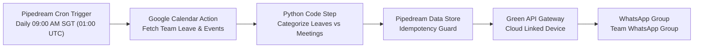

# Daily Team Calendar Summary

Automated daily 9:00 AM (Asia/Singapore) summary of today's and tomorrow's events from the shared Google Calendar (**Team Leave & Events**) delivered directly to the team WhatsApp group (**Team WhatsApp Group**).

---

## The Problem

The initial version of this automation relied on an on-premise runner and local Go bridge (`verygoodplugins/whatsapp-mcp` via WSL) on the user's laptop, triggered by local scheduler tasks. This architecture required the laptop to remain powered on and awake 24/7 for scheduled executions to run.

The objective was to migrate the entire workflow to the cloud under two strict constraints:
1. **Zero Financial Cost ($0.00):** Must operate permanently within legitimate free tiers without surprise bills or credit card commitments.
2. **Zero Laptop Dependency:** Must execute reliably in the cloud with no local hardware requirements.

---

## Architectural Decisions & Evaluation

During research, several cloud architectures and messaging providers were evaluated and ruled out:

| Evaluated Alternative | Result | Reason for Rejection |
| :--- | :--- | :--- |
| **Twilio (WhatsApp)** | ❌ Rejected | Meta's official WhatsApp Business API **cannot send messages to consumer groups** (`...@g.us`). Twilio also has no free production tier, requires credit card billing (~$15+/mo in number rental and per-recipient fees), and requires formal business verification. |
| **Fly.io** | ❌ Rejected | Fly.io deprecated its free tier in late 2024. Running an always-on container with a persistent volume (for session SQLite storage) incurs ongoing monthly costs (~$3–$5/mo). Furthermore, auto-sleeping containers drop WhatsApp WebSockets. |
| **n8n Cloud / Self-Hosted** | ❌ Rejected | n8n Cloud has no free tier (€24/month minimum). Self-hosting requires managing VPS infrastructure and still requires an external WhatsApp Web bridge to message groups. |
| **Android Phone Automation** | ❌ Rejected | Android security models and accessibility services freeze UI interactions behind lock screens, failing when the phone is locked in a pocket. |

### The Chosen Solution: Pipedream + Green API (Developer Tier)



1. **Orchestration (Pipedream):**
   - Runs on Pipedream's permanent Free Tier (100 credits/month, up to 3 active workflows).
   - Daily execution consumes ~1 credit/day (< 2 seconds runtime), well within free allowances.
   - Built-in Google Calendar integration securely accesses the shared calendar via OAuth without manual token refresh scripting.
2. **Delivery Gateway (Green API Developer Tier):**
   - 100% free plan ($0.00, no credit card required).
   - Supports up to 3 active chats (1 group easily satisfies requirements).
   - Acts as a cloud-hosted WhatsApp Web linked device, maintaining the connection 24/7.
3. **Idempotency & Destination Locking:**
   - Messages are destination-locked to the exact pinned group JID (`120363000000000000@g.us`).
   - Runs record state keyed by `(run_date, destination_jid)` to prevent duplicate sends on retries.
4. **Dual-Provider Core Codebase:**
   - `src/safe_whatsapp_mcp.py` supports both `provider: "green_api"` and `provider: "local_bridge"`, allowing seamless testing and local CLI verification alongside the cloud workflow.

---

## Repository Structure

```text
├── config/
│   └── workflow.example.json     # Example configuration schema for local & Green API
├── docs/
│   └── research/                 # Architectural and security evaluation notes
├── pipedream/
│   ├── format_and_send.py        # Production Python step script for Pipedream
│   ├── all_in_one_workflow.py    # Single-step alternative Python script
│   └── workflow_guide.md         # Step-by-step Pipedream setup and deployment guide
├── runtime/                      # Local credentials, tokens, and delivery state (git-ignored)
├── src/
│   ├── calendar_service.py       # Google Calendar API client and range fetcher
│   ├── orchestrator.py           # CLI orchestrator for testing and status checks
│   ├── safe_whatsapp_mcp.py      # Destination-locked WhatsApp service (Green API / Go bridge)
│   └── summary_formatter.py      # Deterministic leave vs meeting formatter
└── tests/                        # Automated unit tests (13 tests, 100% passing)
```

---

## Verification & Testing

Run unit tests locally:
```powershell
python -m unittest discover -s tests -v
```

Check provider and calendar status:
```powershell
python src/orchestrator.py --config runtime/workflow.json --status
```

Run a dry run (fetches live Google Calendar events and previews summary without sending):
```powershell
python src/orchestrator.py --config runtime/workflow.json --dry-run
```

Send a test message to the test group via Green API:
```powershell
python src/orchestrator.py --config runtime/workflow.json --test-send
```

---

## Cloud Deployment

Refer to [`pipedream/workflow_guide.md`](pipedream/workflow_guide.md) for complete instructions on creating the scheduled workflow in Pipedream and deploying the Python step code.
